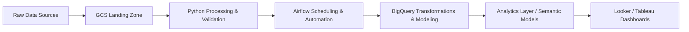

# 🚀 Analytics Engineering Portfolio

Welcome!  
This repository showcases hands-on analytics engineering work focused on building reliable, automated, and cost-efficient data pipelines using modern cloud tooling — especially Google Cloud Platform.

The goal is to demonstrate **real-world patterns**, including orchestration, SQL modeling, cloud workflows, optimization examples, and BI reporting logic.

---

## :eyes: Profile

  
  
  
  

## ⏰ My Local Time

---

## 🧰 Tech Stack

| Category               | Tools                                    |
| ---------------------- | ---------------------------------------- |
| Cloud                  | Google Cloud Platform                    |
| Orchestration          | Apache Airflow / Cloud Composer          |
| Processing             | Python                                   |
| Data Warehouse         | BigQuery                                 |
| Analytics Layer        | Looker, Tableau                          |
| Querying               | SQL (BigQuery SQL)                       |
| CI/CD & Best Practices | Testing, linting, governance coming soon |

  
  
  
  
  
  
  

---

## ☁️ High-Level Data Flow

